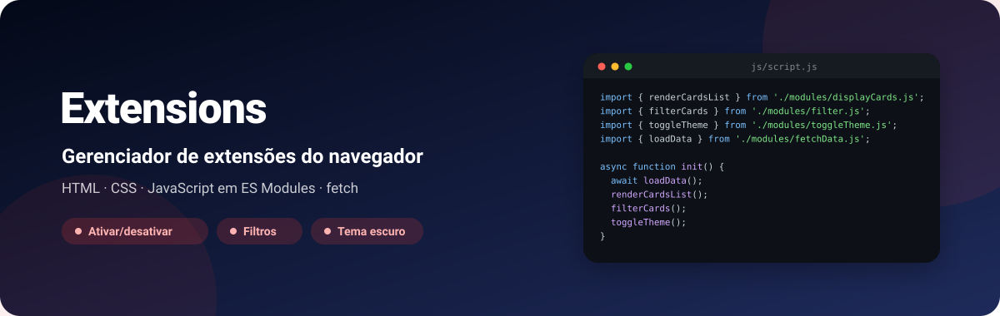
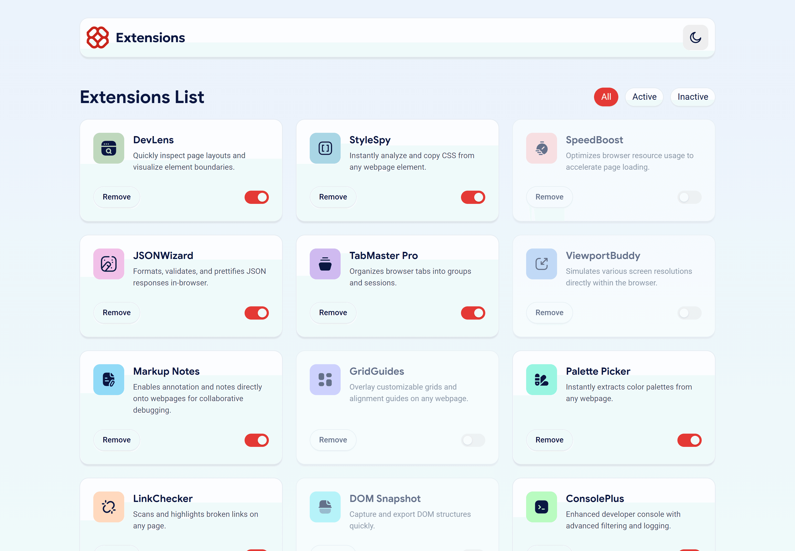
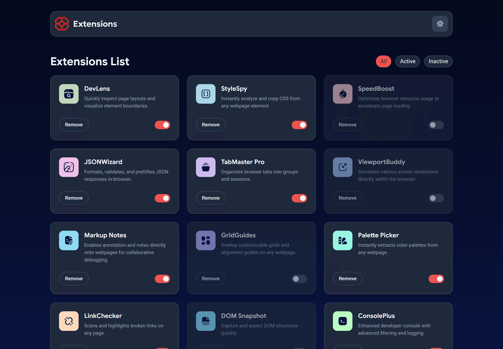
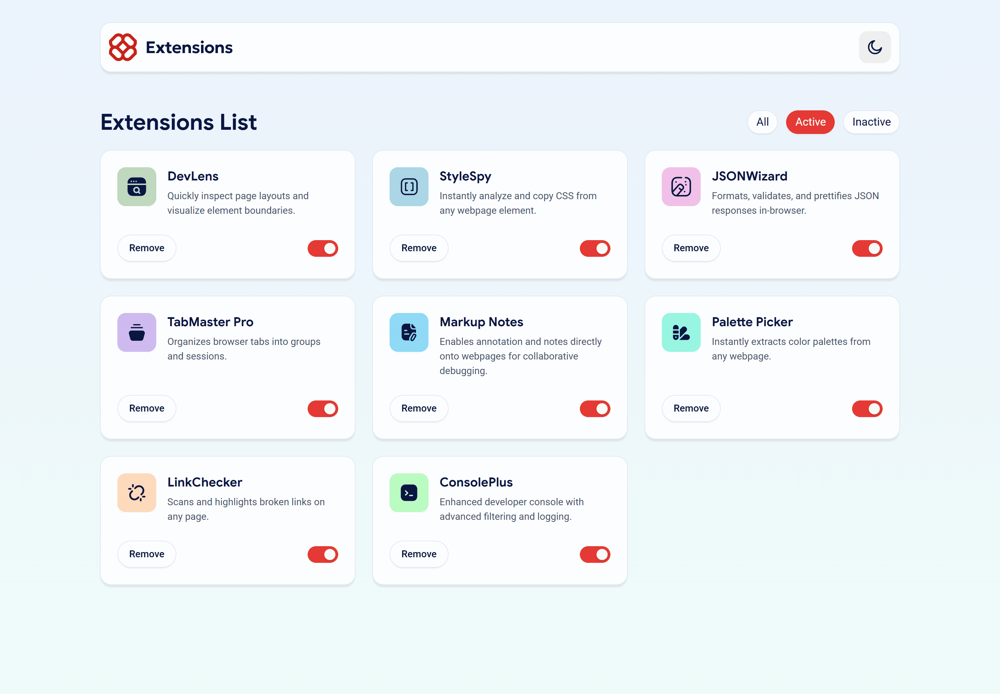
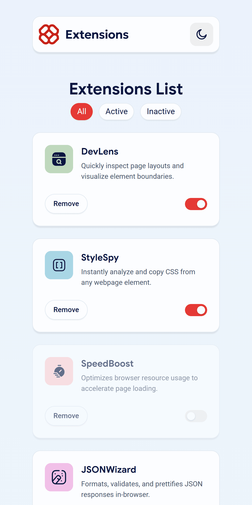
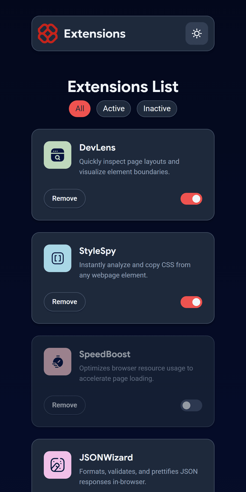

<div align="center">



**Interface de gerenciamento de extensões do navegador: ative e desative, filtre, remova e troque entre tema claro e escuro.**

[](https://kessleru.github.io/front-extensions/)
[](https://github.com/kessleru/front-extensions/actions/workflows/super-linter.yml)
[](https://github.com/kessleru/front-extensions/commits/main)



</div>

## Sobre

Solução para a **Lista 05**, que pede para reproduzir a
[interface de gerenciamento de extensões](https://github.com/andreluizfrancabatista/browser-extensions-manager-ui)
do [Frontend Mentor](https://www.frontendmentor.io) a partir do design e de um `data.json`.

As 12 extensões vêm do `data.json` via `fetch` e viram cards montados por JavaScript. O estado de
cada uma (ativa ou não) vive num array em memória que os filtros consultam, e o tema escolhido fica
salvo no `localStorage`.

## Telas

### Tema escuro

O botão no canto do cabeçalho alterna o atributo `data-theme` no `<html>`; as cores vêm de custom
properties redefinidas em `[data-theme='dark']`.



### Filtro "Active"

Mostra só as extensões ligadas — 8 das 12 no estado inicial.



### Celular

<table>
<tr>
<td width="50%"></td>
<td width="50%"></td>
</tr>
<tr>
<td align="center"><sub><b>Tema claro</b></sub></td>
<td align="center"><sub><b>Tema escuro</b></sub></td>
</tr>
</table>

## Funcionalidades

| | |
|---|---|
| 🔌 **Ativar / desativar** | A chave de cada card atualiza o `isActive` no array e esmaece o card inativo |
| 🔎 **Filtros** | **All**, **Active** e **Inactive** re-renderizam a grade a partir do estado atual |
| 🗑️ **Remover** | Tira a extensão do array e o card do DOM |
| 🌗 **Tema claro/escuro** | Alternado por botão e lembrado no `localStorage` |
| 📱 **Responsivo** | Três colunas no desktop, duas abaixo de 992px e uma abaixo de 610px |
| ✅ **Lint no CI** | [Super-Linter](https://github.com/super-linter/super-linter) roda a cada push na `main` |

## Stack

| Camada | Ferramenta |
|---|---|
| Marcação | HTML5 |
| Estilo | CSS3 — custom properties, Grid, CSS organizado em `base/`, `components/` e `layout/` |
| Lógica | JavaScript em ES Modules, `fetch` e `localStorage` |
| CI | GitHub Actions + Super-Linter |
| Deploy | [GitHub Pages](https://pages.github.com) |

## Rodando localmente

```bash
git clone https://github.com/kessleru/front-extensions.git
cd front-extensions
python -m http.server 8000
```

Abra `http://localhost:8000`.

> **Atenção:** abrir o `index.html` direto no navegador (`file://`) não funciona: o navegador
> bloqueia o `fetch` do `data.json` e os ES Modules fora de um servidor HTTP.

## Estrutura

```
├── index.html
├── data.json                 # as 12 extensões: logo, nome, descrição e isActive
├── css/
│   ├── styles.css            # importa os arquivos abaixo
│   ├── base/                 # reset, variáveis de cor (claro e escuro) e global
│   ├── components/           # card, header e nav (filtros)
│   └── layout/responsivo.css # breakpoints de 992px e 610px
├── js/
│   ├── script.js             # init: carrega os dados e liga os módulos
│   └── modules/
│       ├── fetchData.js      # loadData / getExtensionsData
│       ├── displayCards.js   # monta os cards
│       ├── cardFunctions.js  # chave de ativação e botão Remove
│       ├── filter.js         # All / Active / Inactive
│       └── toggleTheme.js    # tema + localStorage
└── assets/images/            # logos das extensões e ícones de tema
```

<details>
<summary><b>Regerando as imagens deste README</b></summary>

```bash
node .github/readme/gerar.mjs                 # banner.svg

python -m http.server 8000                    # em outro terminal
npm i --no-save puppeteer-core sharp
node .github/readme/capturar.mjs              # telas em 2x, nos dois temas
```

</details>

---

<div align="center">
<sub>Feito por <a href="https://github.com/kessleru">Otávio Kessler Ustra</a> · desafio do <a href="https://www.frontendmentor.io">Frontend Mentor</a></sub>
</div>
